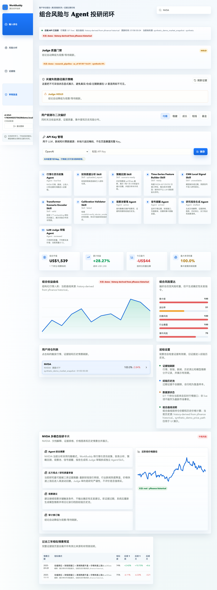

# Investment Research System

Investment Research System 是一个面向个人投资者的 AI 投研工作台。它把持仓、行情、财报/公告、新闻、历史价格和模型推理组织成一条可审计的研究流程，并在前端展示风险、证据、数据来源和结论边界。

它不是股票问答机器人，也不是自动下单系统。项目的核心设计是：每个结论都尽量回到来源、时间、数据模式和风险假设，用户可以区分“事实”“推断”“模型结果”和“需要进一步核验的内容”。



## 项目亮点

- **投研闭环**：注册/登录、风险偏好、持仓、观察列表、研究报告、每日刷新和历史运行记录。
- **证据链**：行情、财务指标、披露、新闻、历史类比和模型推理都以 evidence 记录，并附带来源、观测时间、有效期、置信度和数据状态。
- **数据可信度标注**：`demo`、`sandbox`、`real` 三种模式会影响来源标签、质量门禁和报告措辞，合成行情不会伪装成真实行情。
- **ML 训练与推理**：包含 point-in-time 特征、时间切分、真实数据过滤、风险分布、模型卡和推理契约测试。
- **研究质量 Judge**：对证据充分性、新鲜度、事实/推断边界、反方观点、来源引用、模型校准等维度进行检查。
- **可视化工作台**：轻量 dashboard 视觉，股票/基金图表保留涨跌绿红、风险预警和估值辅助色彩，适合展示研究过程而不是只展示一个结论。

## 面试中的一句话

> 我做了一个有数据可信度和证据链的个人投研工作台：它不只生成摘要，还记录每条研究结论来自哪里、是否过期、是否使用合成数据，以及模型结果应该如何被用户复核。

## 核心用户流程

```text
配置风险偏好与持仓
        |
        v
选择标的 / 打开研究报告
        |
        v
采集行情、披露、新闻、财务与历史价格
        |
        v
形成 evidence graph、风险判断和 ML 推理
        |
        v
质量门禁 + 报告生成 + 用户复核
        |
        v
每日刷新：保存新证据、标记旧证据、比较前后结论
```

## 能力范围

| 模块 | 当前实现 | 说明 |
| --- | --- | --- |
| 账户与会话 | 已实现 | 注册、登录、refresh token、退出和开发者账户 |
| 持仓与风险画像 | 已实现 | 支持股票、ETF/基金式标的、成本价、数量、行业和风险偏好 |
| 研究报告 | 已实现 | 研究摘要、风险等级、证据、审计、模型摘要和 Markdown 报告 |
| 数据来源 | 已实现 | yfinance、AkShare、SEC/公告类来源及本地 demo fallback |
| 证据链 | 已实现 | evidence、claim、edge、历史经验和 superseded 关系 |
| 每日刷新 | 已实现 | 新旧证据比较、过期归档、结论变化和刷新审计 |
| 文档解析 | 已实现 | CSV/TXT/PDF 的文本、表格、图表和脚注块预览 |
| ML pipeline | 已实现 | 数据集构建、训练、推理、PIT 检查和风险分布摘要 |
| 前端工作台 | 已实现 | 研究页、持仓、模型、数据来源、报告和刷新状态 |

## 架构

```text
frontend/                 React + Vite dashboard
    | REST/JSON
backend/app.py            FastAPI composition root
    |
    +-- *_api.py           HTTP route adapters
    +-- *_service.py       business workflows
    +-- *_repository.py    SQLite persistence
    +-- research_domain    evidence graph and quality gates
    +-- reporting          report snapshots and Markdown output
    +-- ml_api/service      dataset, training and inference boundary
    |
data/investment_research.sqlite3    local runtime database, generated and ignored
ml/                       point-in-time data and model pipeline
```

项目刻意保留了 API、service、repository 和 ML pipeline 的边界。SQLite 适合本地演示和测试；如果继续产品化，下一步应把运行存储迁移到 PostgreSQL，并把数据源、证据和模型版本做成显式领域模型。

## 快速开始

环境要求：Node.js 20+、Python 3.10+、可用的 C/C++ 构建工具，以及至少 4 GB 可用内存。真实行情和公告数据还需要网络访问。

```bash
git clone <your-github-url>/investment-research-system.git
cd investment-research-system

npm ci
python3 -m venv .venv
source .venv/bin/activate
python -m pip install --upgrade pip
python -m pip install -r backend/requirements.txt

cp .env.example .env
```

`.env` 只是模板；FastAPI 进程需要在启动前加载它：

```bash
set -a
source .env
set +a
```

启动 API：

```bash
npm run dev:api
```

另开一个终端启动前端：

```bash
cd investment-research-system
npm run dev
```

打开 <http://localhost:5173>。首次进入可在界面注册开发账号、设置风险偏好并录入持仓。默认数据库会生成在 `data/investment_research.sqlite3`，该文件不会进入 Git。

## 数据模式

| 模式 | 用途 | 可信度 |
| --- | --- | --- |
| `demo` | 零配置展示，允许稳定的合成价格路径和固定演示日期 | 仅用于 UI 和流程演示 |
| `sandbox` | 测试外部 provider、API 契约和降级逻辑 | 可能混合 live/degraded 数据 |
| `real` | 尽量只使用真实来源，训练前过滤 synthetic/demo/fallback 行情 | 仍需用户检查来源、时间和覆盖范围 |

```bash
# UI 演示
export INVESTMENT_RESEARCH_DATA_MODE=demo

# 真实数据研究前，建议同时设置 SEC 联系信息
export INVESTMENT_RESEARCH_DATA_MODE=real
export SEC_USER_AGENT="YourName your-email@example.com"
```

项目会在报告中展示 `sourceStatus`、`syntheticRatio`、观察时间和质量门禁。`--allow-synthetic` 只应该用于 smoke test 和本地演示，不能据此宣称模型具备真实投资预测能力。

## 环境变量

| 变量 | 默认值 | 作用 |
| --- | --- | --- |
| `INVESTMENT_RESEARCH_DB_PATH` | `./data/investment_research.sqlite3` | SQLite 路径 |
| `INVESTMENT_RESEARCH_DATA_MODE` | `demo` | 数据模式 |
| `INVESTMENT_RESEARCH_MASTER_KEY` | 无 | API key 等敏感字段的加密密钥 |
| `INVESTMENT_RESEARCH_DEMO_AS_OF` | 固定演示日期 | demo 模式的 as-of 时间 |
| `INVESTMENT_RESEARCH_ALLOWED_ORIGINS` | localhost 前端端口 | CORS 白名单 |
| `VITE_API_BASE` | `http://localhost:8000` | 前端 API 地址 |
| `SEC_USER_AGENT` | demo user agent | SEC 请求联系信息 |

本地运行前请替换 `INVESTMENT_RESEARCH_MASTER_KEY`。不要把真实 API key、数据库、模型输出或 `.env` 提交到仓库。

## 常用命令

```bash
npm run build                 # TypeScript + Vite 前端构建
python3 -m py_compile backend/app.py
python3 -m pytest backend/tests -q
python3 -m pytest e2e -q
bash scripts/verify.sh        # 构建、ML 契约、API smoke 和完整验收路径

npm run train:minimal         # 合成数据的最小训练演示
npm run train:real:smoke      # 小规模真实数据 smoke
npm run train:real            # 真实数据训练入口
```

真实训练可能受数据 provider、网络、限流和本地 CPU/内存影响。训练产物写入 `artifacts/`，该目录被 `.gitignore` 排除。

## 测试策略

- `backend/tests/unit`：认证、数据库、持仓、刷新、报告、ML API 和 service 单元契约。
- `backend/tests/integration`：投研 pipeline、证据图、刷新 loop 和历史类比。
- `ml/tests`：point-in-time、防未来泄漏、真实数据过滤、标签、切分、推理和风险分布。
- `e2e`：注册、onboarding、持仓、刷新、文档分析、训练和研究报告的主链路。

验证重点不是“页面能否显示一个漂亮数字”，而是检查证据引用是否存在、时间是否倒挂、合成数据是否被标记、模型输出是否符合契约、刷新后旧证据是否可追溯。

## 当前边界与诚实说明

1. `demo` 模式包含 `synthetic_demo_price_path`，它是可重复的演示数据，不代表真实市场走势。
2. 外部 provider 可能失败、限流或返回不完整数据，系统会降级并在报告中标注，但不应把降级结果当作投资建议。
3. 当前使用 SQLite 和本地文件存储，适合单机 demo，不适合多实例并发生产部署。
4. 认证、密钥和 CORS 已有基础边界，但仍需要正式的密钥管理、审计存储、限流、CSRF/XSS 防护和部署级安全配置。
5. ML pipeline 展示的是研究基础设施和质量门禁，不是经过监管验证或可直接用于交易的策略。

## 后续路线

- 将 evidence、claim、source、model run 和 portfolio snapshot 提升为稳定的领域模型。
- 将 SQLite 运行存储迁移到 PostgreSQL，并为任务刷新增加幂等键和队列。
- 为每个 provider 增加 schema version、重试预算、来源健康度和缓存策略。
- 增加基准数据集、时间滚动评估、模型卡和可比较的实验记录。
- 将研究报告和 UI 文案进一步区分事实、推断、情景和用户自定义假设。

## 目录

```text
backend/        FastAPI、服务层、repository、迁移和后端测试
frontend/       React/Vite 投研工作台
ml/             数据 ingest、特征、训练、推理、质量和模型测试
data/           运行时数据库目录，默认只保留目录说明
docs/           训练、架构、验收和产品边界文档
e2e/            端到端主流程
scripts/        验证和训练辅助脚本
```

## 免责声明

本项目仅用于软件工程、数据质量和 AI 投研工作流研究，不构成投资、税务或证券建议。任何真实投资决定都应由用户基于独立核验的实时信息和专业意见作出。
