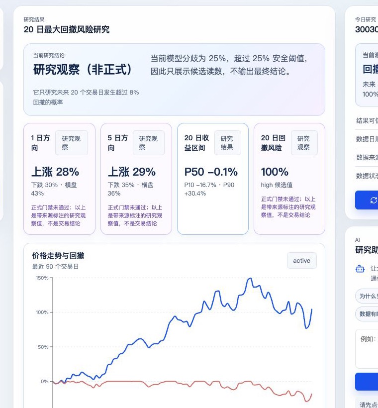
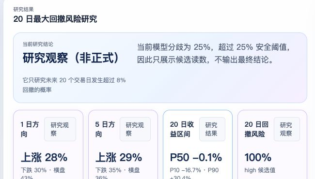
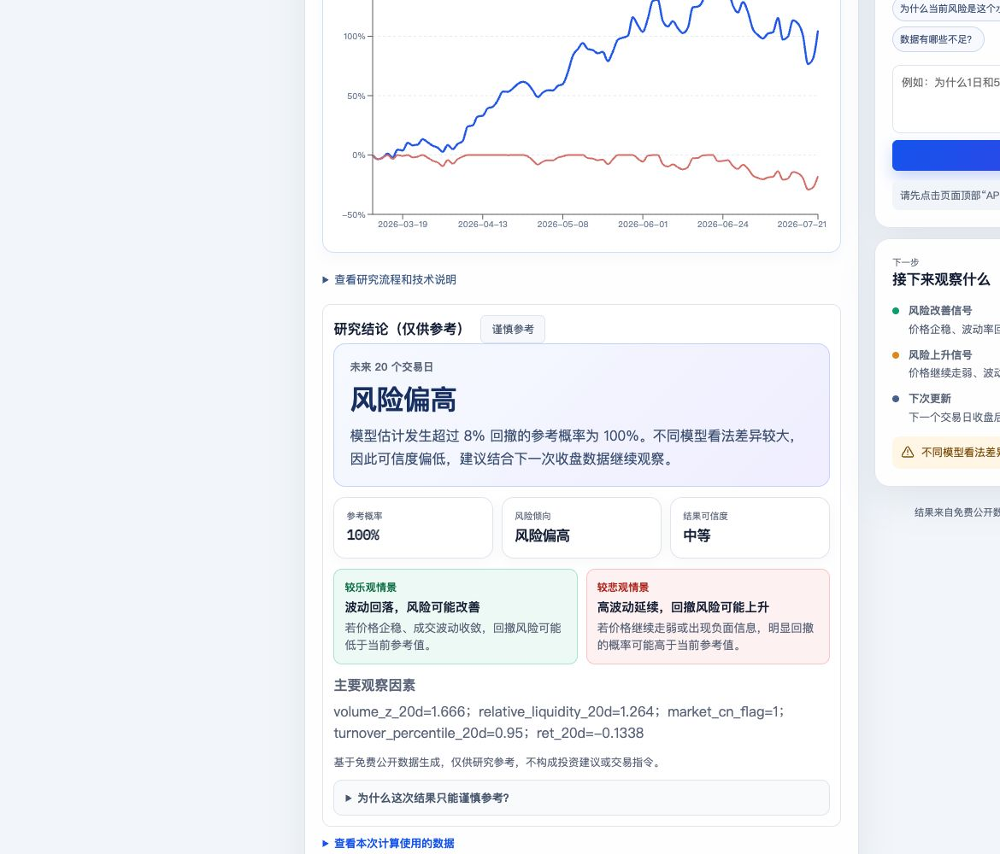
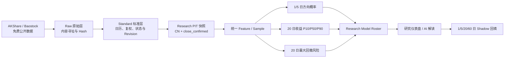

<div align="center">

# A 股量化研究平台

### 零预算 · 研究级 · 可复现 · 证据驱动

面向 A 股日线研究的完整工作台：从免费数据、Research PIT、模型训练、风险解释到 Shadow 前向验证。


</div>

> [!IMPORTANT]
> 本平台使用免费公开数据，所有数据和模型固定为 `research_pit / research_only / deployment_ready=false`。结果仅用于量化研究、教学、比赛展示和模型实验，不构成投资建议，也不能直接用于实盘交易。

**第一次使用？**

- 网页操作：[用户操作手册](docs/用户操作手册.md)
- 带截图的 Word 版本：[A 股量化研究平台－界面与操作手册](docs/A股量化研究平台-界面与操作手册.docx)
- 技术原理：[技术白皮书](docs/technical-whitepaper.md)
- 最快启动：`npm run dev:research-platform`

本项目不追求给出“买入”“卖出”或“明天必涨/必跌”的口号，而是把公开数据下可验证的研究过程完整留存：数据从哪里来、何时抓到、质量如何、模型使用了什么输入、哪些任务可用、何时应主动暂缓判断，以及预测在后续交易日的实际表现。

## 项目界面

### 核心研究仪表盘

同一页面集中展示研究对象、四任务结果、价格与回撤曲线，以及数据和模型的研究级边界。用户先看结论与图表，需要核验时再展开技术与审计详情。

<p align="center">
  
</p>

### 四任务研究结果

方向、收益和回撤任务分别展示，不用单一“涨跌”标签替代概率与区间。每张卡片同时标明它是正式结论、研究观察还是暂不可用。

<p align="center">
  
</p>

### 风险情景与观察依据

风险结果同时提供参考概率、可信度、较乐观/较悲观情景和主要观察因素，帮助用户理解模型为什么给出当前读数，以及下一交易日应该观察什么变化。

<p align="center">
  
</p>

## 你可以用它完成什么

| 能力 | 用户获得的结果 | 系统留下的证据 |
| --- | --- | --- |
| 免费 A 股数据更新 | 股票和 ETF 收盘后研究数据 | Provider、请求窗口、原始/标准化 hash、revision、失败原因 |
| 四任务独立研究 | 1 日方向、5 日方向、20 日收益区间、20 日回撤风险 | 独立 dataset、fold、模型、评估报告与 roster |
| 价格与风险可视化 | 收益走势、回撤轨迹、风险情景 | 冻结数据日期、snapshot ID/hash |
| AI 研究助手 | 用通俗语言解释当前结果与限制 | Function Calling 记录、知识来源、引用链接、工具 hash |
| 数据质量与拒答 | 明确展示 `degraded`、`unavailable` 或 `abstain` 原因 | 覆盖率、缓存状态、Provider 冲突、模型分歧 |
| Research Shadow | 真实记录当时预测，并在未来回填结果 | 1/5/20/60 日 append-only 前向验证 |
| 技术与审计 | 查看模型版本、运行血缘和正式模式阻断原因 | Manifest、artifact hash、审计 Gate、固定报告 |

## 一分钟理解系统



一次用户研究的核心流程是：

1. 选择固定研究池中的股票或 ETF。
2. 系统读取已经冻结的收盘数据和数据质量状态。
3. 四个任务分别加载精确匹配的研究模型与校准器。
4. 页面展示概率、区间、风险、模型分歧和数据限制。
5. 如果证据不足，模型候选读数仍可作为研究观察展示，但必须明确标记限制。
6. AI 助手只能调用服务端允许的只读工具，不自行计算价格或风险概率。
7. 当日结果进入不可变 Shadow，未来只追加真实结果回填。

当前主线是 **CN + close_confirmed**：A 股日线与少量宽基 ETF，在每个交易日收盘确认后运行。系统输出四类相互独立的研究结果：`direction_1d`、`direction_5d`、`return_20d` 和 `drawdown_20d`。所有公开数据及其模型产物永久标记为：

```text
data_tier=research_pit
status=research_only
deployment_ready=false
```

这意味着它适合比赛展示、论文式实验、回测、模型比较和每日收盘后 Shadow 前向验证；不适合实时行情、交易执行、面向公众的投资建议或正式商业发布。

## 先读这一节：项目边界

### 当前可以做什么

- 使用 AKShare 作为公开研究主源，Baostock 作为公开研究备用/交叉校验源。
- 采集并保留原始响应、抓取时间、请求信息、内容 hash、标准化 revision 与质量状态。
- 对 A 股日线和固定研究池做数据质量审计、快照冻结、特征构建、标签构建、时间滚动训练与研究级推理。
- 比较线性/逻辑回归、随机森林、LightGBM、XGBoost，以及 MLP、TCN、PatchTST、iTransformer 等 challenger。
- 生成不可变 Research Shadow，并在 1、5、20、60 个有效交易日后追加回填结果。
- 在网页中查看数据状态、模型 roster、任务状态、证据、hash、拒答原因和 Shadow 进度。

### 当前明确不能做什么

- 不把 AKShare、Baostock、公开网页或缓存数据称为交易级实时行情。
- 不把 `research_pit` 升级为 `formal_pit`，不把研究模型设为 `approved` 或 `deployment_ready=true`。
- 不从风险概率反推方向，不从方向概率伪造收益区间。
- 不在数据过期、关键价格缺失、Provider 冲突、输入漂移或模型分歧过大时强行输出预测。
- 不输出买卖指令、仓位建议、保证收益或确定性涨跌结论。

### 两种模式的关系

| 模式 | 数据 | 可运行的内容 | 发布状态 |
| --- | --- | --- | --- |
| A 股研究模式（默认） | 免费公开数据 | 研究、训练、复盘、Shadow | `research_only` |
| 正式授权模式（保留） | 需授权、SLA、历史可见时间与 revision 证据 | 未来企业/生产路径 | 当前固定 `blocked` |

正式模式保留是为了证明数据治理边界，而不是当前版本的交付前提。没有授权数据时，正式模式应当显示阻断原因，不能阻碍研究模式运行。

## 目录导航

| 路径 | 用途 |
| --- | --- |
| `src/investment_research/` | FastAPI、领域模型、Repository、训练、推理、Research Shadow 核心实现 |
| `workbench-ui/` | React/Vite 研究工作台前端 |
| `scripts/` | 数据采集、PIT 重建、训练、推理、验收、Shadow 回填与启动脚本 |
| `config/` | 固定研究池、免费数据目录、任务与门禁配置 |
| `alembic/`、`migrations/` | 数据库迁移 |
| `tests/` | 后端、训练、PIT、API、迁移与序列模型测试 |
| `artifacts/` | 运行后生成的报告、manifest、模型 roster、Shadow 与验收证据（不入 Git） |
| `var/` | 本地 SQLite、原始数据、cursor、Parquet 等运行状态（不入 Git） |
| `docs/` | 原理、模型研究、演示和故障案例文档 |

建议阅读顺序：本 README → [技术白皮书](docs/technical-whitepaper.md) → [模型研究报告](docs/model-research-report.md) → [演示脚本](docs/demo-script.md) → [失败案例集](docs/failure-casebook.md)。

## 1. 环境要求

### 必需软件

- Python 3.10 或更高版本。
- Node.js 20 或更高版本，配套 npm。
- Git。
- macOS、Linux 或 WSL 均可。Windows 原生环境请使用 PowerShell 对应命令，并确保 Python 与 Node 在 PATH 中。

### 推荐资源

- 16 GB 内存可运行小规模研究、前端与常规测试。
- 32 GB 内存更适合完整研究池与深度 challenger。
- 首轮请使用小规模 smoke 参数，不要一开始同时跑全股票池、全历史和全部深度模型。

### 可选服务

- SQLite 是本地开发默认存储，无需安装数据库即可验证核心流程。
- PostgreSQL + MinIO 只用于正式存储适配与迁移验收，见后文“正式授权模式”。
- AKShare/Baostock 访问需要网络；网络、限流、字段变动或公开源失败会被如实记录为降级/阻断，不会自动使用 synthetic 数据。

## 2. 从零安装

以下命令均在仓库根目录执行。

```bash
git clone <你的仓库地址>
cd Hack

# 建议创建独立虚拟环境
python3 -m venv .venv
source .venv/bin/activate

# 安装后端、测试、文档与训练依赖
python3 -m pip install --upgrade pip
python3 -m pip install -e ".[dev,documents,train]"

# 安装前端依赖
npm install
```

如果只想启动页面和 API、暂不训练深度模型，可先安装：

```bash
python3 -m pip install -e ".[dev,documents]"
```

训练完整深度 challenger 时，Torch、LightGBM、XGBoost、PyArrow 与 Baostock 必须可导入。安装失败不要伪造“备用源可用”或“深度模型已运行”；请保留安装错误并以 `blocked`/`unavailable` 呈现。

## 3. 基础配置

复制示例配置并按本机需求修改：

```bash
cp .env.example .env
```

Python 进程默认读取操作系统环境变量；如需让当前 shell 使用 `.env`，在执行脚本前加载它：

```bash
set -a
source .env
set +a
```

项目在本地默认使用 SQLite：

```dotenv
INVESTMENT_RESEARCH_ENV=development
INVESTMENT_RESEARCH_DATABASE_PATH=./var/investment_research.db
INVESTMENT_RESEARCH_DATABASE_URL=sqlite:///./var/investment_research.db
```

常用可选环境变量：

| 变量 | 作用 | 默认建议 |
| --- | --- | --- |
| `INVESTMENT_RESEARCH_LOG_LEVEL` | 后端日志级别 | `INFO` |
| `RESEARCH_VISION_PROVIDER` | 文档图片检查 Provider | `disabled` |
| `RESEARCH_AUDIT_NETWORK_ENABLED` | 是否允许受控权威来源检索 | `false` |
| `INVESTMENT_RESEARCH_MINUTE_COLLECTION_ENABLED` | 分钟数据开关 | `false`，不要开启 |
| `INVESTMENT_RESEARCH_MARKET_DATA_PRIMARY_PROVIDER` | 正式授权主源 | 研究模式下留空 |
| `INVESTMENT_RESEARCH_MARKET_DATA_BACKUP_PROVIDER` | 正式授权备用源 | 研究模式下留空 |

`.env.example` 只提供配置说明。请勿将真实密码、密钥、访问令牌、数据库快照、原始 payload、模型二进制或个人资料提交到 Git。

## 4. 启动本地工作台

一条命令会启动 API、数据库迁移、调度器和 Vite 前端：

```bash
npm run dev:research-platform
```

启动后访问：

| 地址 | 用途 |
| --- | --- |
| `http://127.0.0.1:5173` | A 股研究工作台 |
| `http://127.0.0.1:8000/health` | API 健康检查 |
| `http://127.0.0.1:8000/docs` | FastAPI OpenAPI 文档（开发环境） |

首次打开页面时：

1. 默认选择 **A 股研究模式**。
2. 注册本地用户或登录已有用户。
3. 在“研究对象”中创建或选择 A 股/ETF 标的。
4. 页面会明确展示研究级公开数据、非实时、非投资建议、不可直接交易。
5. 正式模式可查看，但没有授权数据时应显示 `blocked`，这是正确行为。

若端口被占用，可指定端口：

```bash
python3 scripts/start_research_platform.py --api-port 8010 --web-port 5180
```

## 5. AI 研究助手与金融知识库

页面顶部的 **API Key** 只配置用户自己选择的大模型服务。密钥写入本地加密凭据库，前端和查询接口都不会返回明文；没有配置密钥时，量化研究、图表和确定性门禁仍可运行，只是不生成大模型自然语言解读。

配置完成后，在右侧“研究助手”中选择问题或输入自己的问题。助手不能直接访问任意网络、文件、SQL 或交易接口，只能由服务端选择并执行以下只读 Function Calling 工具：

| 工具 | 读取内容 |
| --- | --- |
| `get_price_trend` | 冻结时点前最多 90 个日线收盘价、20 日收益与波动率 |
| `get_four_task_forecasts` | 1/5 日方向、20 日收益区间、20 日回撤四个独立研究任务 |
| `get_company_announcements` | 决策时点前已公开并进入证据库的公司公告 |
| `get_shadow_performance` | 不可变 Research Shadow 的有效场次和回填数量 |
| `search_financial_knowledge` | 带发布日期、生效时间、可见时间、来源 URL 和内容 hash 的金融知识 |
| `collect_pit_evidence` / `build_29_features` / `approved_model_inference` / `quality_gate` | 原有 PIT 证据、特征、模型与质量门禁 |

金融知识目录由迁移 `0017_financial_knowledge` 创建。每条知识记录均保存 `published_at`、`effective_from/to`、`available_at`、revision、来源链接和内容 hash；检索会按本次研究的 `as_of` 过滤，不能把后来发布或后来修订的规则用于历史解释。公开知识固定为 `research_pit`，API 不能把它直接写成 `formal_pit`。

需要特别理解：**门禁拒绝模型结论，不等于助手什么都不能解释。** 当数据质量、模型分歧或证据覆盖不满足门槛时，助手仍会解释已经读取到的价格、模型候选值、数据限制和后续观察条件，并将状态标为“模型结论暂缓”。它不会把这些参考读数包装成正式预测或买卖建议。回答下方的“引用来源”可以打开公告或知识来源；没有外部引用时，页面会明确说明回答只整理了平台结构化数据。

知识库查询接口（均需登录）：

```text
GET  /api/v1/financial-knowledge
GET  /api/v1/financial-knowledge/search?q=...&as_of=...
POST /api/v1/financial-knowledge
```

新增知识时必须使用 HTTPS 来源、正确的 SHA-256 内容 hash，并满足 `available_at >= published_at`；重复内容按 hash 幂等返回旧记录，不覆盖历史内容。

## 6. 最快验证：不联网 Dry Run

先确认编排顺序和 Python 依赖，而不抓取任何数据：

```bash
python3 scripts/run_cn_research_demo.py --dry-run
```

成功时会打印固定阶段清单，并始终显示：

```json
{
  "data_tier": "research_pit",
  "deployment_ready": false
}
```

Dry run 不创建可用模型、不访问 Provider、不代表真实训练完成。

## 7. 一键 A 股研究链路

完整研究演示入口：

```bash
python3 scripts/run_cn_research_demo.py
```

它按以下顺序执行，每一步都将状态写入运行报告；某个 cohort 或任务失败时，已完成证据仍会保留，整体可能以非零退出码结束：

```text
免费数据增量采集
  → 原始 payload/hash 保存
  → Research PIT 重建与质量 Gate
  → 固定 cohort / MarketSnapshot 冻结
  → 四任务同 fold 训练与评估
  → roster、manifest、报告 hash 冻结
  → 精确 scope 推理
  → 不可变 Research Shadow 冻结
  → 后端验收报告
```

默认设计目标是 100 只股票 + 5 只 ETF；实际运行会严格执行最少样本、最少历史、质量与 Provider Gate。公开源覆盖不足时，正确结果是 `partial`、`blocked`、`unavailable` 或 `abstain`，不是降低门槛生成看似正常的预测。

### 建议先跑小范围 smoke

以下命令只用于确认连通性与产物结构，不能作为正式研究结论：

```bash
python3 scripts/run_cn_research_demo.py \
  --max-symbols 20 \
  --max-equities 20 \
  --minimum-equities 1 \
  --minimum-cohort-symbols 1 \
  --minimum-history-sessions 60 \
  --symbols-per-cohort 1 \
  --skip-sequence-challengers
```

完成后优先查看：

```text
artifacts/cn_research_demo/latest.json
artifacts/cn_research_demo/latest-backend-acceptance.json
```

每次实际运行还会生成带 `run_id` 的不可变副本。不要手工编辑报告、manifest 或 hash；修改后应被校验阻断。

### 如何理解一键报告

`artifacts/cn_research_demo/latest.json` 至少应查看以下字段：

| 字段 | 含义 |
| --- | --- |
| `status` | `research_complete`、`partial` 或 `blocked` |
| `data_tier` | 必须是 `research_pit` |
| `deployment_ready` | 必须是 `false` |
| `stages` | 每个采集/重建/训练/推理/Shadow 阶段的退出码与日志尾部 |
| `cohorts` | 股票池和 ETF 池的成员数、快照、阻断原因 |
| `tasks` | 四任务各自的训练状态、manifest 与评估证据 |
| `inference` | 推理数、拒答数和按任务统计 |
| `shadow` | 冻结的 Shadow 目录与状态 |
| `backend_acceptance` | Provider、任务 artifact、hash、Shadow 与正式模式阻断的复核结果 |

## 8. 数据层与质量治理

### 数据分层

| 层 | 保存内容 | 是否可覆盖历史 |
| --- | --- | --- |
| Raw | Provider 原文、请求、抓取时间、payload hash | 否，append-only |
| Standard | 统一代码、OHLCV、复权口径、revision、质量结果 | 否，revision 新增 |
| Feature | 冻结快照上的特征、缺失掩码、feature hash | 否，按快照重建 |
| Sample | 特征与未来标签、决策时间、标签窗口、样本状态 | 否，按版本重建 |

每条免费历史回补数据都保留 `historical_available_at_unproven_public_backfill`。这允许研究训练和历史评估，但永久阻断正式 PIT 发布。

### Provider 规则

CN 价格路径只允许：

```text
AKShare → Baostock
```

CN 不允许 yfinance 作为当前研究 PIT 回退。AKShare 与 Baostock 均失败时，覆盖账本记录 `fetch_failed`、Provider chain 和原因；不会改用其他数据源，也不会生成 synthetic 默认价格。

缓存状态只有：

```text
fresh / stale_usable / expired / unavailable
```

超过三交易日的缓存只能触发 `abstain`。事件覆盖状态只有：

```text
events_present / confirmed_none / unsupported /
fetch_failed / pending_update / partial
```

只有 `events_present` 与 `confirmed_none` 能表示有效事件计数；其他状态必须通过缺失掩码进入特征和页面，不得伪装为零事件。

### 单独采集与查看目录

查看免费数据目录与支持范围：

```bash
python3 scripts/fetch_free_research_data.py --list-catalog
```

仅抓取价格：

```bash
python3 scripts/fetch_free_research_data.py --markets cn --only prices
```

只做原始层采集而不重建 PIT：

```bash
python3 scripts/run_free_research_cycle.py --skip-rebuild
```

正常收盘后循环（采集 + 重建）：

```bash
python3 scripts/run_free_research_cycle.py --decision-context close_confirmed
```

常见运行位置：

```text
var/cn-research/raw/                  原始公开数据与 cursor
var/cn-research/catalog.db            本地数据目录
artifacts/free_research_coverage.json Provider 覆盖账本
artifacts/free_research_rebuild/      PIT 重建索引、样本与泄漏报告
artifacts/cn_research_cohorts/        固定研究池版本与排除原因
```

## 9. 固定研究池与 PIT 样本

当前股票池目标：沪深市场、非北交所、较长上市历史、近 120 日覆盖足够、流动性合格、当前非 ST/非停牌的股票；并固定 ETF：

```text
510050 / 510300 / 510500 / 159915 / 512100
```

股票池按季度更新，日常运行不动态换股。免费数据无法充分证明历史证券状态时，manifest 会记录幸存者偏差限制；不得把结果宣传成全市场、无幸存者偏差的结论。

重建时系统检查：

- 交易日缺口与重复日期。
- OHLC 合法性、非正价格、异常成交量/成交额。
- raw 与 qfq 口径、复权变化、停牌、ST、涨跌停、一字板。
- Provider 冲突：收盘价偏差超过 0.2%、成交量偏差超过 2% 或交易日集合不一致时，标的当天不得预测。
- cohort 版本、snapshot ID/hash、`research_pit` 数据等级与 `synthetic_count=0`。
- `available_at <= decision_time` 证据；免费回补缺失该证据时必须保留研究级限制。

## 10. 四项研究任务

| 任务 | 输出 | 标签与时间范围 | 不可替代关系 |
| --- | --- | --- | --- |
| `direction_1d` | up/down/flat 三分类概率 | 下一可交易开盘后的 1 日方向 | 不由风险模型推导 |
| `direction_5d` | up/down/flat 三分类概率 | 下一可交易开盘后的 5 日方向 | 独立标签与校准 |
| `return_20d` | P10/P50/P90 收益区间 | 20 日收益分布 | 不由方向概率推导 |
| `drawdown_20d` | 最大回撤分布、阈值回撤概率、排序 | 20 日内最大回撤 | 不等同于下跌概率 |

标签从决策后的首个可交易开盘开始。停牌或无法买入的一字涨停最多顺延 5 个交易日；无法入场或窗口不足的样本不进入训练。收益标签采用快照冻结的 qfq 口径；涨跌停、停牌与可交易状态始终使用 raw 口径。

## 11. 训练与模型比较

### 固定验证协议

所有任务在同一研究快照、同一特征契约和全市场时间边界下运行：

```text
504 个交易日训练窗
126 个交易日验证窗
purge / embargo = 该任务 horizon
最近 252 个交易日 = 一次性最终留出
其中最近 126 个交易日 = 压力切片
校准 = 仅使用 time-OOF prediction
```

最终留出只用于一次评估，不得据此反复调参。标准化、缺失填充、特征筛选、阈值选择和校准器都只能在对应训练窗口拟合。

### 候选模型

| 任务 | 传统主线 | 深度 challenger |
| --- | --- | --- |
| 方向 | 恒定类别、指数方向、动量、随机、逻辑回归、随机森林、LightGBM、XGBoost | Deep MLP、TCN、PatchTST、iTransformer |
| 收益 | 历史分布、线性分位数、Quantile RF、LightGBM/XGBoost 分位数 | 时序模型分位数输出 |
| 回撤 | 历史分布、逻辑回归、随机森林、LightGBM、XGBoost | 时序风险与排序 challenger |

深度模型不会因为架构复杂而成为 primary。分类 challenger 至少要在两个有效 regime 相对最佳表格模型提升 `>= 0.03 AUROC`，且 Brier/ECE、覆盖率与三个随机种子稳定性不恶化；收益 challenger 要在多个状态下稳定改善 pinball loss。未达标仍保存完整实验记录，但保持 `research_only`。

### 成本与可交易性

研究评估默认采用保守、版本化成本假设：10 万元研究名义本金；股票买卖佣金各 3bp、卖出印花税 5bp、买卖滑点各 5bp；ETF 无印花税、买卖滑点各 3bp；并考虑 T+1、停牌、涨跌停与流动性约束。这只用于研究比较，绝不生成交易建议。

## 12. 模型清单（Roster）与推理

训练结果不会被前端任意扫描。每个 scope：

```text
CN + close_confirmed + cohort_version + task
```

必须有独立的 manifest、模型文件、评估报告、feature order、normalizer/imputer、calibrator 和 hash 证据。推理路由只能加载精确 scope；禁止跨市场、跨上下文、跨任务 fallback，也禁止使用旧 bundle 或旧风险模型伪装方向/收益模型。

目录示例：

```text
artifacts/free_research_models/
  cn/close_confirmed/<cohort>/<task>/
    task_manifest.json
    research_model_roster.json
    evaluation.json
    leakage_report.json
    fold_report.json
    calibration_report.json
    artifact_hash_report.json
    ...模型及预处理产物...
```

常见推理状态：

| 状态 | 含义 | 页面行为 |
| --- | --- | --- |
| `research_only` | 研究级数据与模型可被研究路由使用 | 展示概率/区间及限制 |
| `unavailable` | 缺 manifest、模型或必要报告 | 不显示空概率，展示原因 |
| `abstain` | 数据过期、覆盖不足、Provider 冲突、漂移或分歧过大 | 显示“证据不足，暂不预测” |
| `blocked` | 正式授权/PIT/审批条件缺失 | 说明正式模式阻断原因 |

固定拒答条件包括：特征覆盖率低于 85%、缓存过期、Provider 冲突、artifact hash 不一致、超出训练分布特征比例超过 20%、方向总变差超过 0.30、回撤概率差超过 0.25 或收益 P50 分歧超过 5 个百分点。

## 13. Research Shadow：真正的前向验证

每个有效交易日、收盘质量 Gate 通过后，系统最多冻结一次 Shadow。原始记录不可修改，至少保存：

- 交易日、决策上下文、snapshot ID/hash、价格与 Provider chain。
- 四任务预测、raw/calibrated 输出、置信区间、模型分歧与解释事实。
- 模型/校准器/roster hash、数据质量 mask、事件缺失 mask、cache 状态。
- 是否 abstain 以及完整 reason code。

回填只追加，不回写预测，在 T+1/T+5/T+20/T+60 记录收益、方向、MAE/MFE、最大回撤、停牌/涨跌停与数据完整性。20 个有效 session 才生成第一份前向报告；60 个有效 session 后才允许考虑更换 research primary。免费数据 Shadow 永远不计入正式发布门槛。

需要回填时：

```bash
python3 scripts/backfill_research_shadow.py \
  --session-id <shadow-session-uuid> \
  --standard-manifest <对应标准层-manifest.json>
```

## 14. 前端使用说明

工作台首页按以下阅读顺序设计：

1. 顶部：当前市场、决策上下文、研究/正式模式、数据等级与 strict gate。
2. 左侧：研究对象搜索、股票/ETF 信息及数据来源状态。
3. 中部：Research Hero、四任务结果、数据质量、影响因素、价格/回撤图。
4. 右侧：Roster、Shadow、审计、Provider、lineage 与正式模式阻断证据。

页面上出现的状态不是“好/坏”的简单颜色，而是文字与原因的组合。点击任务卡可展开模型版本、快照 hash 和证据细节。没有对应产物时，任务必须显示 `unavailable`；不能让 UI 通过空字段猜测结果。

页面固定提示“研究级公开数据、非实时、非投资建议、不可直接交易”。如果你看到“证据不足，暂不预测”，这表示 Gate 正常工作，而不是前端故障。

## 15. API 与验收证据

开发环境 API 文档：`http://127.0.0.1:8000/docs`。

研究响应的顶层状态契约包括：

```text
data_status
training_status
model_status
prediction_status
evidence_status
blocking_reasons
abstain_reasons
```

后端验收报告由以下命令生成（通常一键演示会自动调用）：

```bash
python3 scripts/generate_cn_research_acceptance.py \
  --run-report artifacts/cn_research_demo/latest.json \
  --output artifacts/cn_research_demo/manual-backend-acceptance.json
```

报告会复核：四任务 artifact/manifest/report hash、覆盖率、AKShare/Baostock 成功/失败/切换、事件状态、Shadow 冻结/回填、正式模式阻断原因，以及 `deployment_ready=false`。

## 16. 测试与发布前检查

提交前建议依次运行：

```bash
# 后端、PIT、训练、API、迁移相关测试
python3 -m pytest -q

# 不同时区下的核心时间语义检查
TZ=UTC python3 -m pytest -q
TZ=Asia/Shanghai python3 -m pytest -q
TZ=America/New_York python3 -m pytest -q

# 前端单元/E2E 与生产构建
npm test -- --run --no-file-parallelism
npm run build:workbench

# 空白差异检查
git diff --check
```

如果只需要完整基础校验，也可运行：

```bash
npm run verify
```

测试通过不表示模型可以正式发布；它只证明代码契约、时间语义和现有 Gate 未被破坏。

## 17. 常见问题与排查

### 1）一键演示以退出码 2 结束

先打开 `artifacts/cn_research_demo/latest.json`，查看 `status`、`stages`、`blocking_reason` 与每个 task 的 `gating_reasons`。常见原因是：免费 Provider 限流/不可用、股票池不足、历史窗口不足、质量 Gate 失败、依赖未安装或模型未达到研究 Gate。不要通过改小 Gate 或复制旧模型文件解决。

### 2）Baostock 未接管 AKShare

确认训练依赖已安装：

```bash
python3 -m pip install -e ".[train]"
python3 -c "import akshare, baostock, pyarrow; print('providers ready')"
```

然后检查 `artifacts/free_research_coverage.json` 的 `provider`、`provider_chain`、`status` 和失败原因。CN 不会回退到 yfinance。

### 3）页面显示 `unavailable` 或 `abstain`

这是预期的安全状态。查看页面中的 `gating_reasons` 和 `abstain_reasons`，或对应 run 的验收报告。常见原因包括缺 roster、模型 hash 不一致、缓存过期、覆盖不足、事件源失败、Provider 冲突与输入漂移。

### 4）正式模式显示 `blocked`

这是当前免费数据路线的预期结果。正式模式需要授权数据源、SLA、历史 `available_at`、revision、证券状态、公司行动与正式 Shadow 证据；这些条件不齐时不得解除阻断。

### 5）端口 8000/5173 已被占用

使用 `--api-port` 与 `--web-port` 启动，或停止占用端口的旧进程。不要同时启动多份使用同一 SQLite 文件的写入服务。

### 6）数据库或开发状态异常

本地开发数据位于 `var/`。先备份需要保留的 SQLite、raw 与 artifacts，再清理本地运行状态并重新执行迁移/演示。不要删除已用于复盘的 Shadow 或报告副本。

## 18. 正式授权模式（未来扩展）

正式路径使用 PostgreSQL + 对象存储 Parquet，并要求商业数据主源/备用源、授权证明、SLA、历史可见时间、revision、证券状态、公司行动和完整审计证据。其入口保持 fail-closed：

```bash
python3 scripts/run_formal_pipeline.py --config config/formal_training.yaml --dry-run
```

只有全部预检、PIT/leakage、训练、校准、最终留出、审批、artifact hash 和至少 20 个有效正式 Shadow session 均通过，才可能请求发布。当前免费研究数据永远不能绕过这些条件。

本地 PostgreSQL/MinIO 验收环境定义在 [compose.yml](deploy/local-infra/compose.yml)。配置 `.env` 中的 `INVESTMENT_RESEARCH_POSTGRES_PASSWORD`、`INVESTMENT_RESEARCH_MINIO_ACCESS_KEY` 和 `INVESTMENT_RESEARCH_MINIO_SECRET_KEY` 后可运行：

```bash
python3 scripts/validate_postgres_minio.py
```

这一步是存储适配验证，不等同于正式模型发布。

## 19. 进一步阅读

- [技术白皮书：架构、PIT、模型门禁、安全与可复现性](docs/technical-whitepaper.md)
- [模型研究报告](docs/model-research-report.md)
- [失败案例集](docs/failure-casebook.md)
- [演示脚本](docs/demo-script.md)
- [四市场 PIT 正式发布规划（未来能力）](docs/four-market-pit-release.md)
- [旧后端归档政策](docs/legacy-backend-archive.md)

## 20. 使用与贡献原则

- 任何新数据源必须显式声明数据等级、授权状态、Provider、抓取时间、质量与覆盖范围。
- 任何新特征必须声明 PIT 可用时间、缺失语义、覆盖率与特征合同版本。
- 任何新模型必须独立保存数据/特征/标签/fold/校准/代码/依赖 hash。
- 任何前端新增结论必须直接来自后端状态契约，不能由空字段或展示层推断。
- 任何“模型更好”的结论都必须来自同一快照、同一 fold、同一最终留出与同一成本假设下的比较。
- 不要把研究模式结果写成投资建议，也不要把正式模式的 `blocked` 当作需要绕过的障碍。
